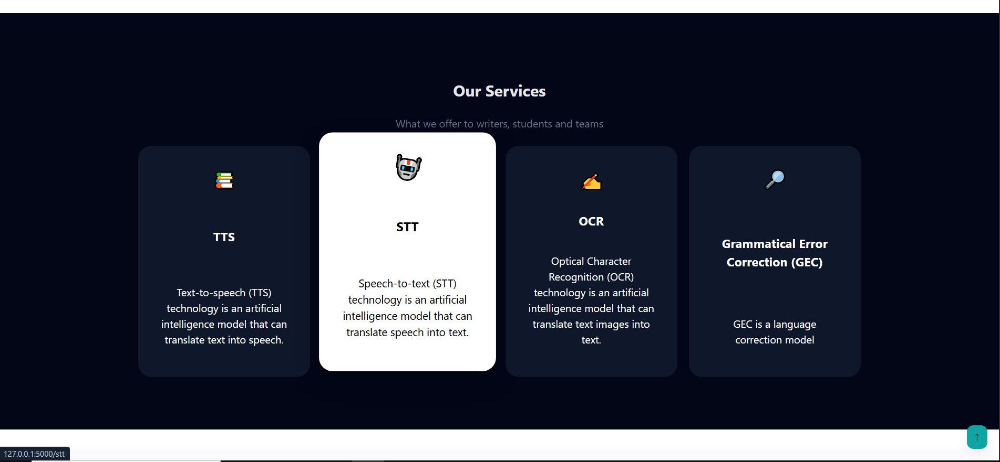
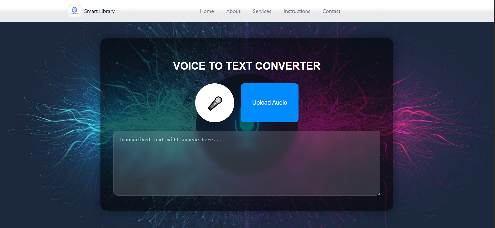

# Smart AI Library

A web application that uses artificial intelligence models for text processing.  
The application currently includes four AI models, with potential for future expansion and improvements.

---

## Included AI Models

1. **Text-to-Speech (TTS)**  
   Converts text into speech.

2. **Speech-to-Text (STT)**  
   Converts audio into text.

3. **Optical Character Recognition (OCR)**  
   Extracts text from images.

4. **Grammatical Error Correction (GEC)**  
   Corrects grammar and spelling errors in text.

---

## Features

- Real-time text processing using multiple AI models.  
- Accessible website from any device at any time.  
- Flexible text processing for different purposes.  
- Simple and interactive interface for smooth user experience.

---

## Installation
1. Clone the repository:
```bash
git clone https://github.com/Elnwsany/smart_ai_library.git
```
2. Create a virtual environment:
```bash
python -m venv venv
```
3. Activate the virtual environment:
```bash
venv\Scripts\activate          # On Windows
source venv/bin/activate       # On Linux/Mac
```
4. Upgrading pip:
```bash
python -m pip install --upgrade pip
```
5. Install dependencies:
```bash
pip install -r requirements.txt
```

6. Run the project:
```bash
python app.py
```
**The initial run may take some time due to the loading of AI models.**

> ⚠️ **Warning**
>  
> - Model files are very large (up to 800MB).
> - GitHub does not support files larger than 100MB, so the models are not included in the repository.
> - The project will automatically download the required model files when run for the first time.
> - Initial loading may take longer during this first run.
> - If your GPU supports CUDA and MPS, the project will run significantly faster than on a CPU.


## Usage

1. Open the app in your browser at [http://localhost:5000](http://localhost:5000).  
2. Click on the **Services** button to navigate to the models section.  
3. Select a model to use:

- **TTS (Text-to-Speech)**:  
  Enter text or upload a text file, then click **Send Text** to generate audio.  

- **STT (Speech-to-Text)**:  
  Start recording audio or upload an audio file. After processing, the converted text will appear in the text field.  

- **OCR (Optical Character Recognition)**:  
  Upload one or more images. The extracted text will appear after processing.  

- **GEC (Grammatical Error Correction)**:  
  Enter text, click **Process**, and the corrected text will appear in a separate field.


---

## Contributing

1. Fork the repository.  
2. Create a new branch (`git checkout -b feature-name`).  
3. Make your changes.  
4. Commit your changes (`git commit -m "Add some feature"`).  
5. Push to the branch (`git push origin feature-name`).  
6. Open a Pull Request.

---

## Optional: Screenshots (Recommended)

  
_Home page showing the main navigation and welcome section._

  
_Services section with available AI features._

  
_Speech-to-Text page where users can record and convert audio to text._

---

## Technologies Used

- Python  
- Flask  
- Whisper (STT/TTS)  
- Tesseract OCR  
- transformers
- HTML, CSS, JavaScript(using Fetch API)